# Installation System

## 1. System Requirements

| Component | Minimum (Lab / PoC) | Recommended ~500 agents (Production) |
|-----------|----------------------|---------------------------|
| CPU       | 4 cores              | 16 cores                 |
| RAM       | 8 GB                 | 24 GB (≥ 32 GB if many service, users, devices) |
| Storage   | 30 GB SSD            | 100 GB SSD / NVMe (expandable) |
| OS        | Linux (Ubuntu/CentOS recommended) | Linux (Ubuntu/CentOS recommended) |
| Docker    | Docker & Docker Compose installed | Docker & Docker Compose installed |
| Domain    | Optional (can use local IP) | Public domain with valid SSL certificate (no self-signed) for Backend and Headscale, internal domain for Frontend |
| Network   | Local network        | Public network, Firewall, Reverse Proxy (Nginx/Caddy) - Port 80/443 HTTP, 50051 TCP/GRPC|

## 2. Download

```bash

git clone https://github.com/ZTrustWorks/ztrust_deploy.git
```

## 3. Configuration

```bash

cd ztrust_deploy
```

## 3.1. Config Headscale

You can get the latest Headscale config file from [here](https://github.com/juanfont/headscale/blob/main/config-example.yaml)

```bash
# Create config directory
mkdir -p backend/config/headscale

# Copy config file
cp backend/config/example/headscale/config.yaml backend/config/headscale/config.yaml

# Create extra-records.json file
touch backend/config/headscale/extra-records.json

```
### Server Configuration
Config your public domain in `server_url` in `backend/config/headscale/config.yaml`

`listen_addr` should be `0.0.0.0:8080`

<div>
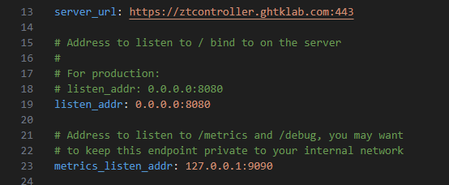
</div>

### DERP Configuration

Config DERP server
if you have your own DERP server, config it in `backend/config/headscale/config.yaml`

For setup DERP server, please follow [this](https://github.com/ZTrustWorks/ztrust_wiki/blob/main/Installation%20guide/derp_server.md) guide

DERP can be configured via `urls` (eg. https://derp.ghtklab.com) or `paths` (use local file `derp-example.yaml`)

E.g: `derp-example.yaml`

```yaml
regions:
  1: null # Disable DERP region with ID 1
  900:
    regionid: 900
    regioncode: custom
    regionname: My Region
    nodes:
      - name: 900a
        regionid: 900
        hostname: myderp.example.com
        ipv4: 198.51.100.1
        ipv6: 2001:db8::1
        stunport: 0
        stunonly: false
        derpport: 0
```

<div>
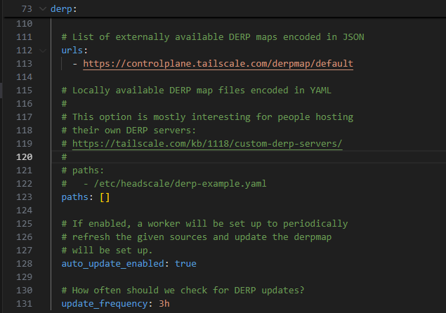
</div>


### Database Configuration

Use `postgres` as database

<div>
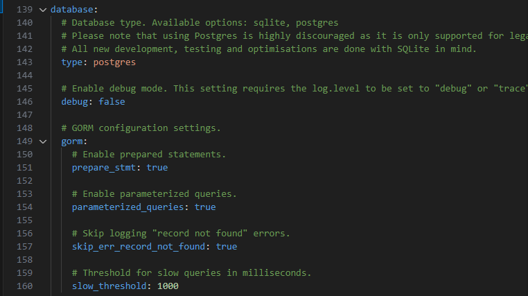
</div>

Config postgresql connection in `backend/config/headscale/config.yaml`

<div>
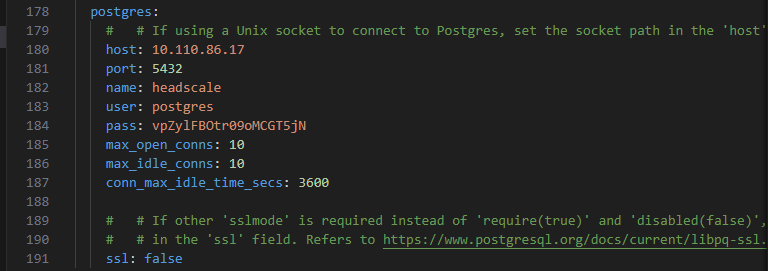
</div>

## 3.2. Config Backend

```bash

cp env.sample .env
```

### Server Configuration

Config your public domain with valid SSL certificate in `ENDPOINT_CONTROLLER_URL` in `.env`

Firewall should allow port 80/443 HTTP, 50051 TCP/GRPC

E.g: `ENDPOINT_CONTROLLER_URL=https://ztcontroller.ghtklab.com`

- `ENDPOINT_CONTROLLER_ADDR` should be `0.0.0.0:8090`
- `ENDPOINT_CONTROLLER_FE_URL` is the internal domain for admin to access the portal, e.g `https://ztrust.ghtklab.com`
- `GRPC_ADDR` should be `:50051` for gRPC connection from agent to backend
- `GIN_METRICS_ADDR` should be `127.0.0.1:9099` for monitoring metrics

<div>
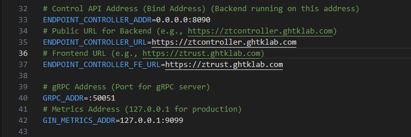
</div>

### Database Configuration

You can change database connection in `.env` if you want to use external database for more high availability. Otherwise, `setup.sh` will create internal `mongo`, `postgres` and `redis` containers automatically.

<div>
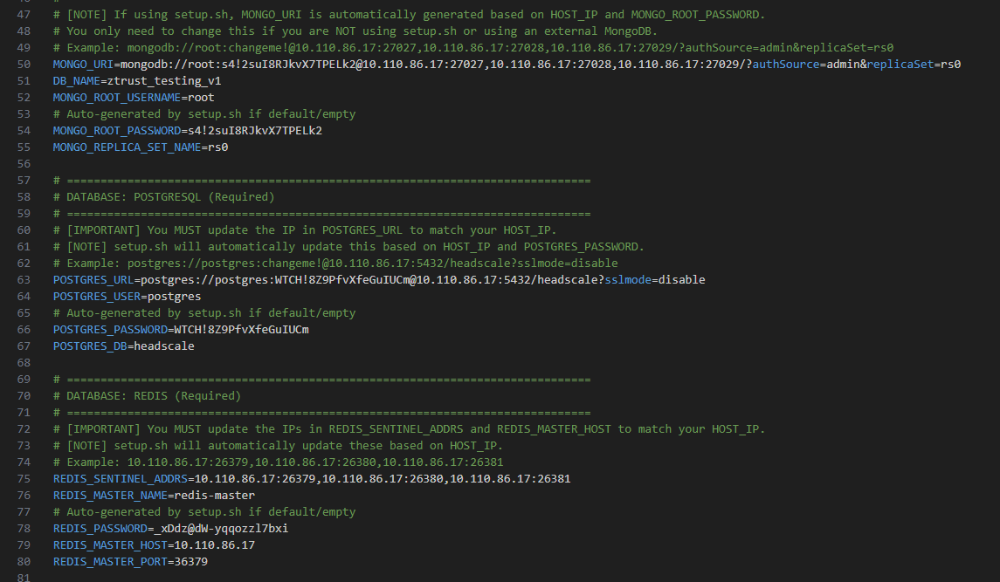
</div>


### Config Headscale URL (You should keep it as default)

<div>
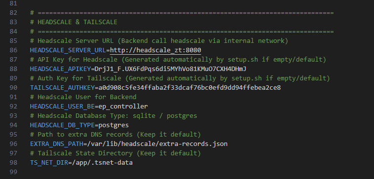
</div>

### Google OAuth Configuration

Add ClientID and ClientSecret from Google OAuth in `.env`

- `GOOGLE_CLIENT_ID`: Client ID from Google OAuth
- `GOOGLE_CLIENT_SECRET`: Client Secret from Google OAuth
- `GOOGLE_REDIRECT_URL`: Redirect URL from Google OAuth should be `https://<your-backend-domain>/public/api/v1/auth/google/callback`

Ensure add `https://<your-backend-domain>/public/api/v1/auth/google/callback` to authorized redirect URIs in Google OAuth on Google Cloud Console

<div>
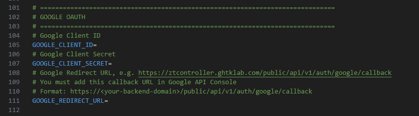
</div>

### Security Configuration

Keep `AGENT_STATIC_TOKEN` as default, for agent to connect to backend while authentication

- `JWT_KEK` is used for JWT encryption, random generated by `setup.sh` script automatically
- `SUPER_ADMIN_PASSWORD` is used for super admin password, random generated by `setup.sh` script automatically

keep it as default

<div>
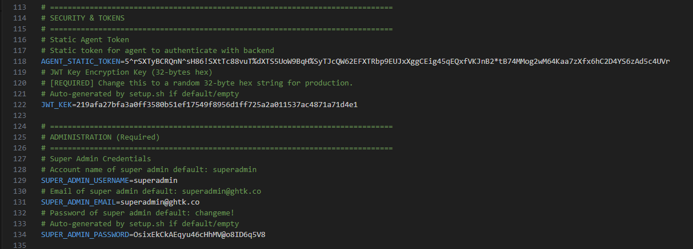
</div>

### Alert Configuration

**Email Alert**

- `SMTP_HOST`: SMTP host
- `SMTP_PORT`: SMTP port
- `SMTP_USERNAME`: SMTP username
- `SMTP_PASSWORD`: SMTP password
- `EMAIL_FROM`: SMTP from email

**Telegram Alert**

- `TELEGRAM_BOT_TOKEN`: Telegram bot token
- `TELEGRAM_CHAT_ID`: Telegram chat ID
- `TELEGRAM_ENABLE_COMMAND`: Enable Telegram command

<div>
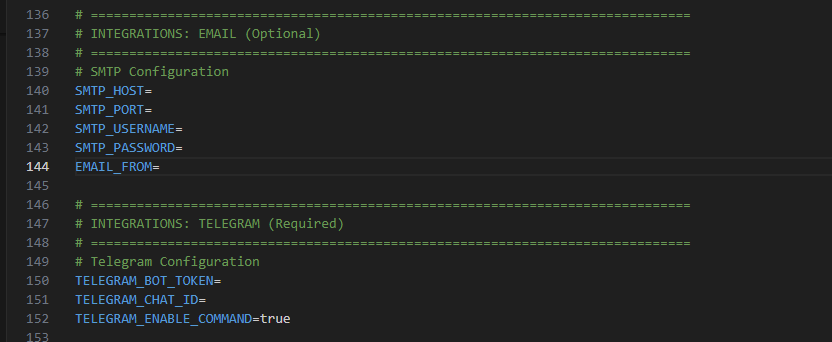
</div>

### Integration Configuration

**Send Log to SIEM via Kafka**

<div>
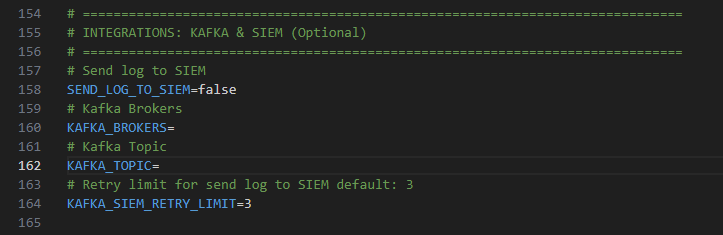
</div>

### Agent Configuration

- `AGENT_CONTROL_WORKER_COUNT`: you can change this environment based on your vCPU core in server, 1 worker per vCPU core, high value will improve performance but may cause high CPU usage

- `CUSTOM_PROTOCOL_AGENT`: is custom protocol agent, for validate custom protocol agent, when redirect securely to agent, you should keep it as default

- Others environment variables are optional, you should keep it as default

<div>
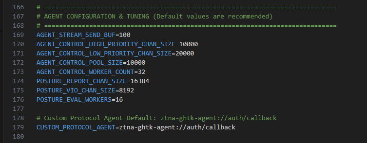
</div>

### Monitoring Configuration

You can monitor metrics of `mongo`, `postgres`, `redis`, `headscale` and `ZTrust BE` via `grafana` with `prometheus`

<div>
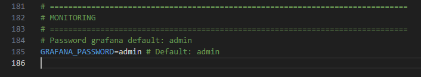
</div>

## 4. Run

After configuration, run `setup.sh` script to start all containers.

```bash
chmod +x setup.sh
sudo ./setup.sh
```

You will be asked to input for additional integrations press `Enter` to skip if you configured it in `.env` file

<div>
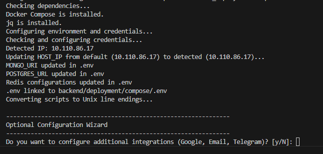
</div>

Next, you will be asked to input for headscale url, press `Enter` to skip if you configured it in `./backend/config/headscale/config.yaml` file

<div>
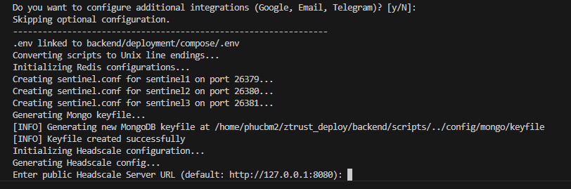
</div>

Script will take a while to start all containers

If any error occurred, please check logs via `docker logs <container_name>`


<div>
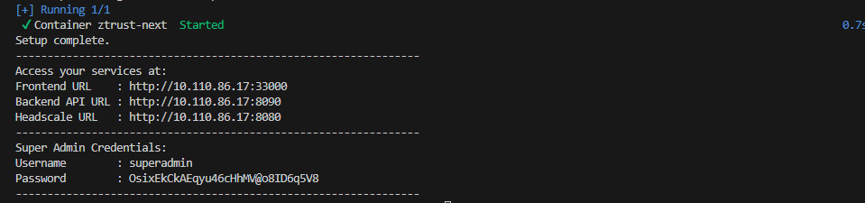
</div>

### Verify 

Ensure all containers are running, focus on `headscale_zt`, `postgres`, `mongo`, `redis`, `ztrust_be`, `ztrust_fe`

```bash
sudo docker ps

```
Check logs

```bash
sudo docker logs <container_name>
```

Finally, you can access to ZTrust portal via IP address of server for quick test 

<div>
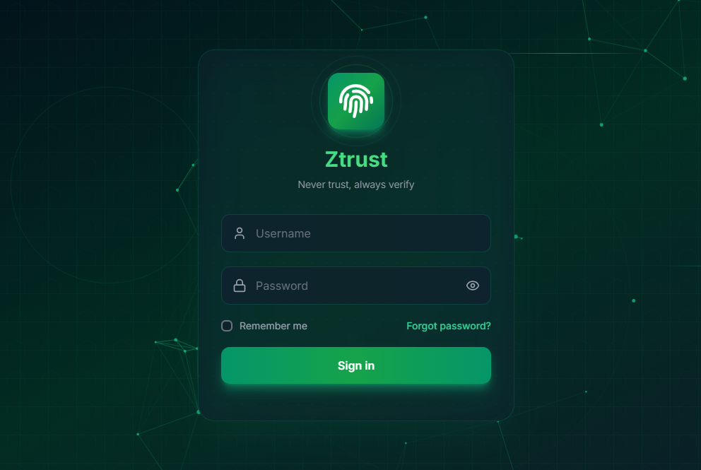
</div>