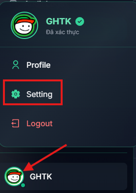
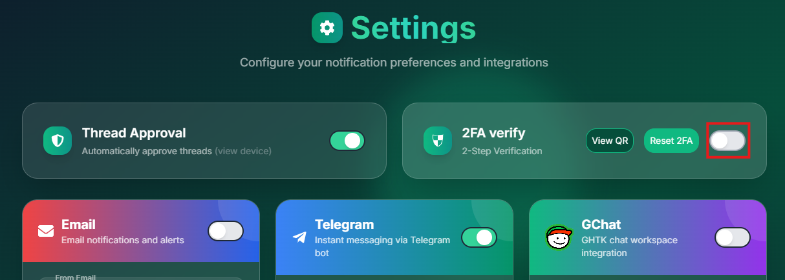
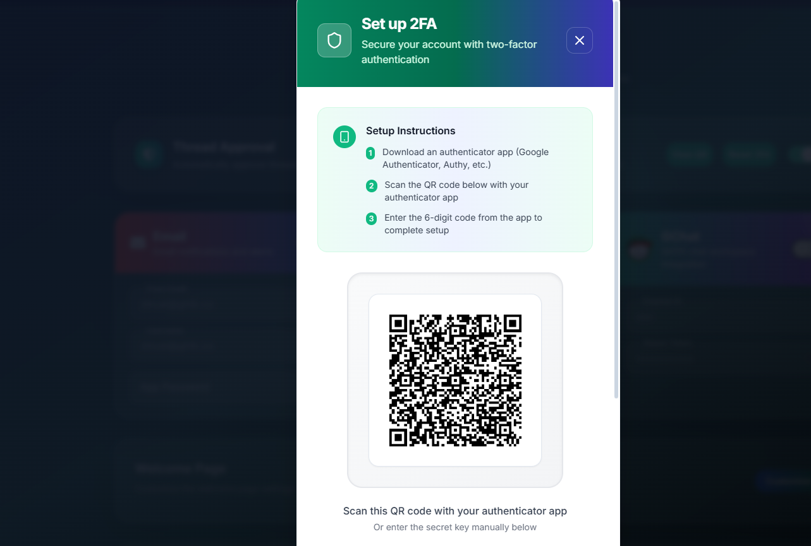
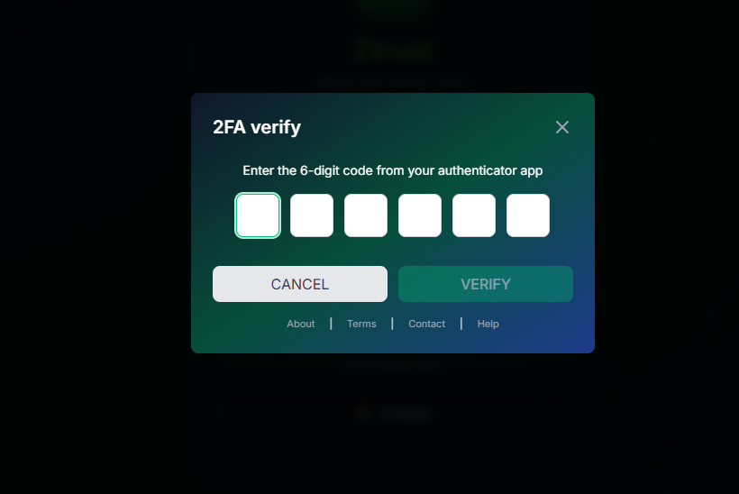

# 2FA Configuration

## Setting

Click on your profile icon at the bottom left corner and select `Settings`.

  

### Enable 2FA

Click to enable 2FA in `2FA verify`

  

After that, Click `View QR` to view QR code and scan it with `Google Authenticator` app.

  

### Login with 2FA

  

Enter your 2FA code got from Google Authenticator

  

