# Operations Documentation

| Operation | Description |
| :--- | :--- |
| [2FA Configuration](2fa.md) | Setup Two-Factor Authentication |
| [Device Management](device-management.md) | Manage devices, approval, isolation |
| [Policy Management](polices.md) | Manage ACLs, groups, and hosts |
| [DNS Management](dns-management.md) | Manage DNS in your organization |
| [Node Gateway](routes.md) | Node Gateway configuration |

## Authentication

You can login to the ZTrust Controller using the following credentials:

Password is value set for `SUPER_ADMIN_PASSWORD` in the `.env` file. Default password is `changeme!`

- Username: `superadmin`
- Password: `changeme!`

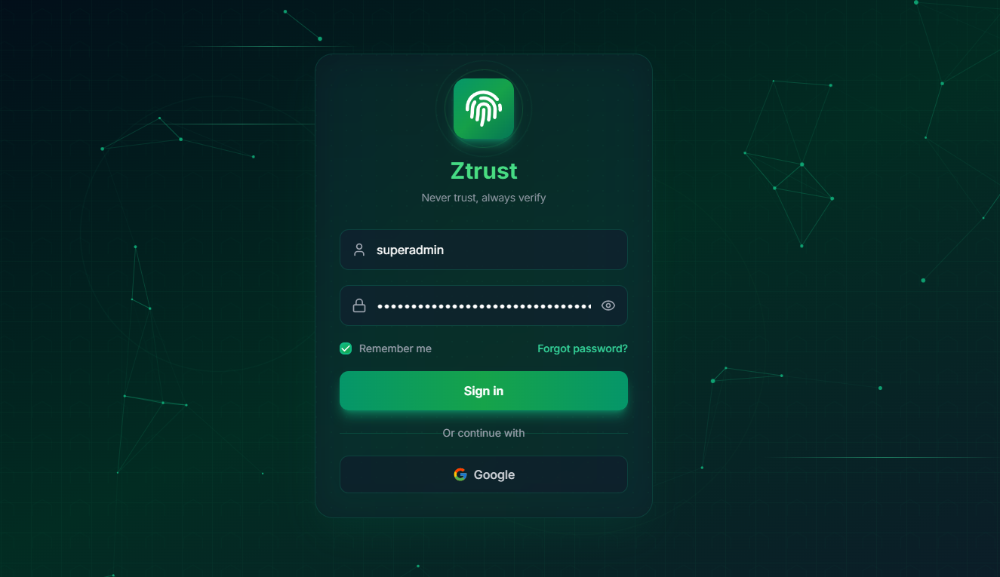

## Dashboard

User and device overview
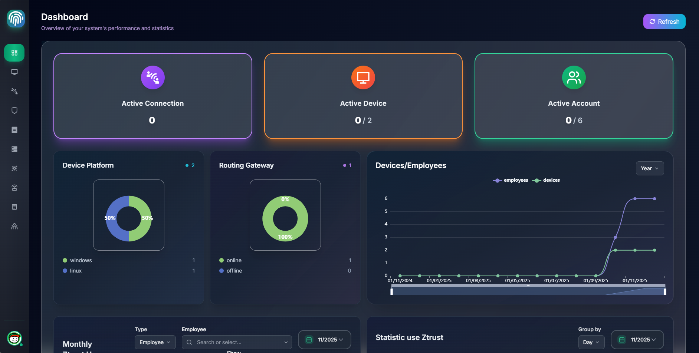

Time usage of each user
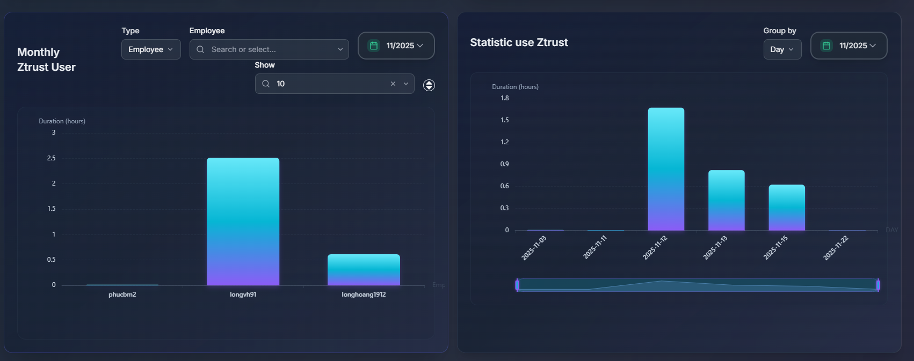

## Device Management

Manage device, approve, isolate, delete device in your organization

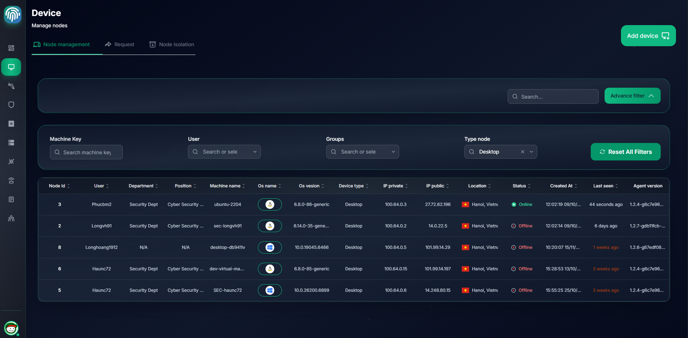

See [Device Management](device-management.md) for more details

## Peer Connections

Manage peer connections in your organization

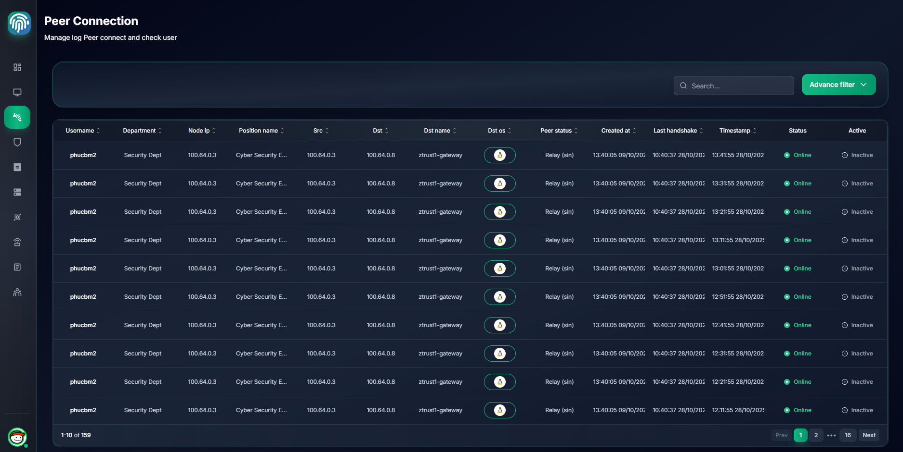

## Network Policy Management

Manage ACL, groups, hosts, etc in your network

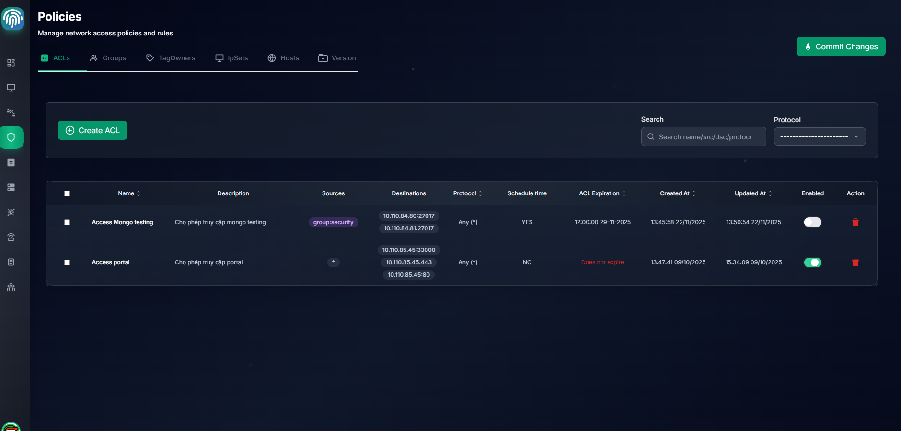

See [Policy Management](polices.md) for more details

## Posture Checks

Manage posture checks in your organization

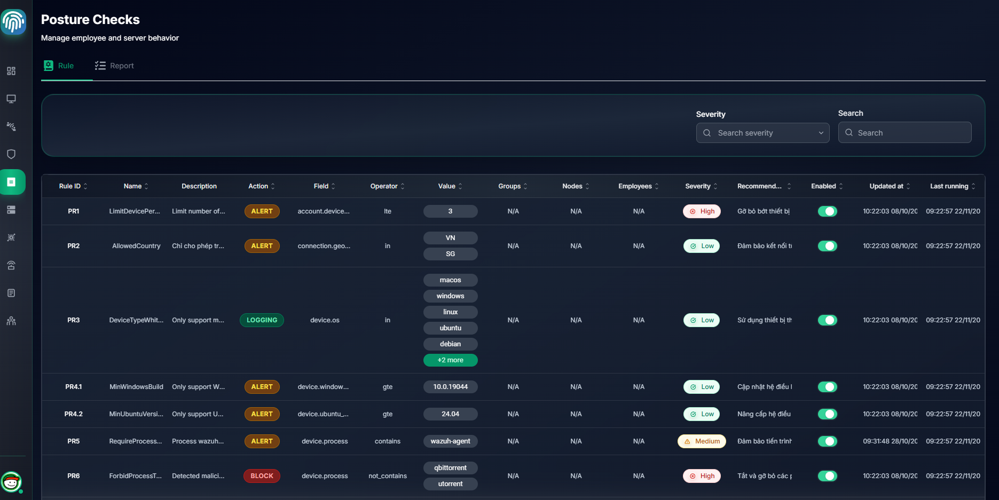

## Routing DNS 

Manage routing and DNS in your organization

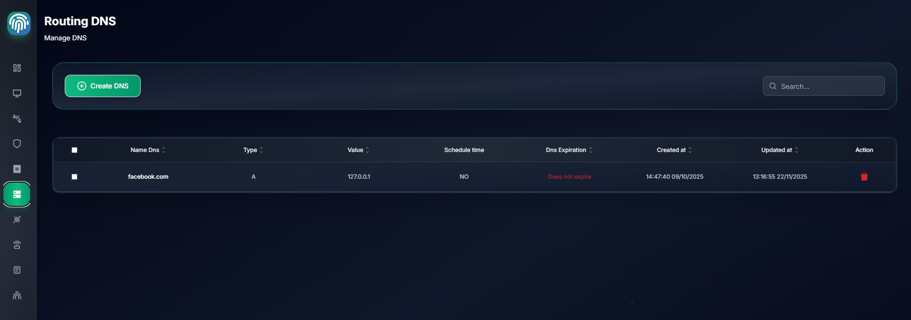

## Routing Configuration

Manage routing configuration in your organization

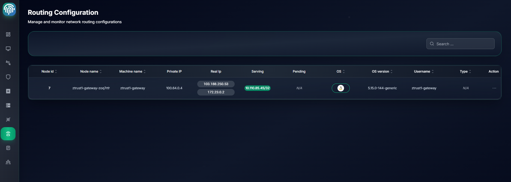

## Audit Logs

Audit logs show all actions performed by users and devices in your organization

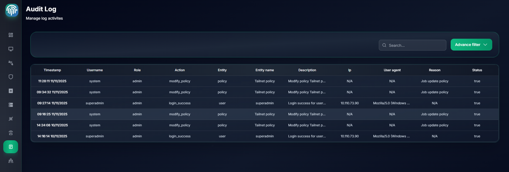

## User Management

Manage user accounts and device ownership

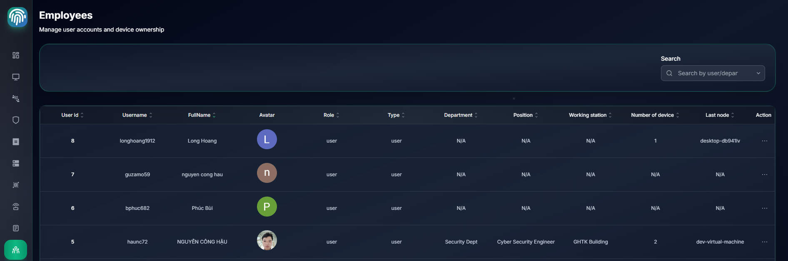
