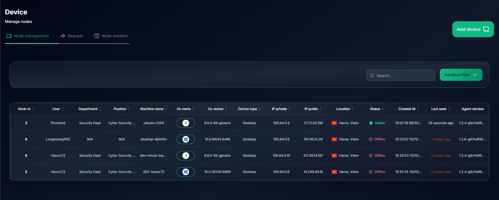
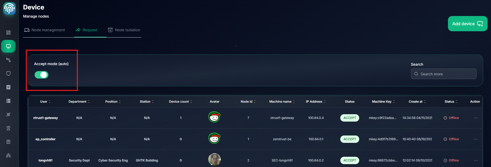

# Device Management

## Device List

You can see all devices in your organization in Tab `Node Management`

## Approve Device

In tab `Request`, you can approve a device join your network automatically or manually

If `Accept mode` is `Auto`, the device will be approved automatically

If `Accept mode` is `Manual`, the device will be approved manually

## Isolate Device

You can isolate a device to prevent it from accessing the network immediately, that device will be isolated until you unisolate it

`Click a device` > `Actions` > `Isolate Machine`

You can unisolate a device to allow it to access the network in Tab `Node Isolation`

