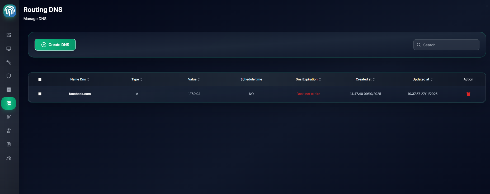
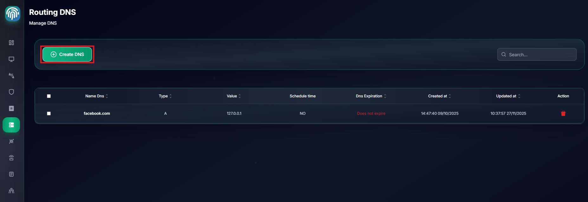
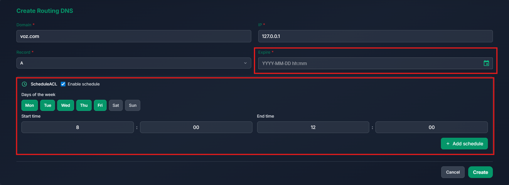
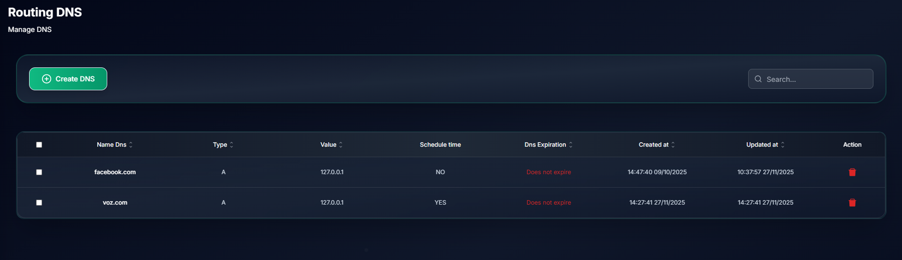

# DNS Management

Manage DNS in your organization

## Create DNS

Tab `Routing DNS`-> Create DNS

Enter DNS name and description

- Enter domain name and IP address for DNS
- You can configure `expire` time and `Schedule` for DNS
- Click `Create` to create DNS

Devices (only devices `Up` with --accepts-dns=true default for desktop devices) in your network will use this DNS to resolve domain name to IP address

