# Polices Management

## Groups Management

### Create Group

Policy group is used to group policies for easy management

Tab Policy Group -> Create Group
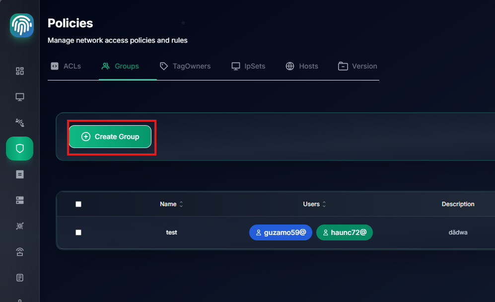

Select user you want to add to group

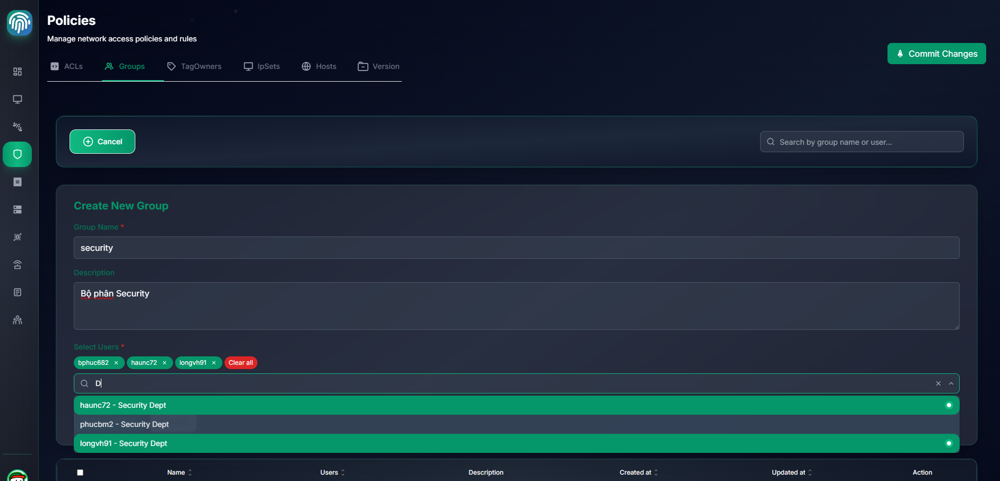

Click Create Group

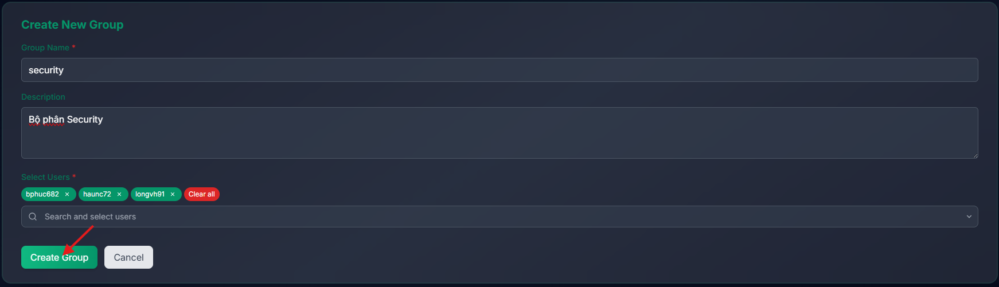

Group `security` is created

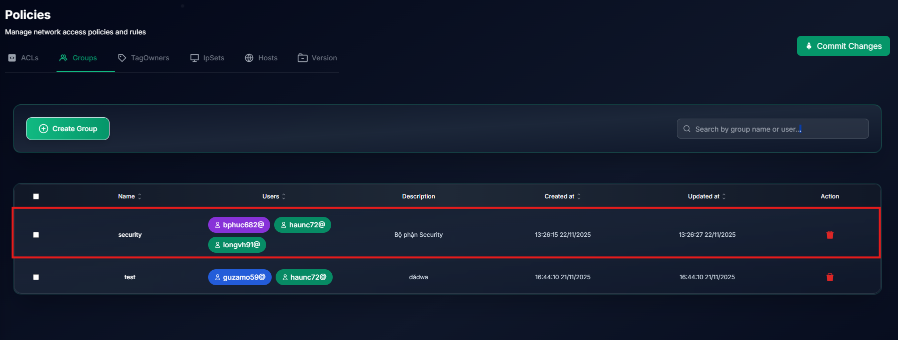

### Edit Group

Click to group name to edit group

### Delete Group

Click to trash icon to delete group

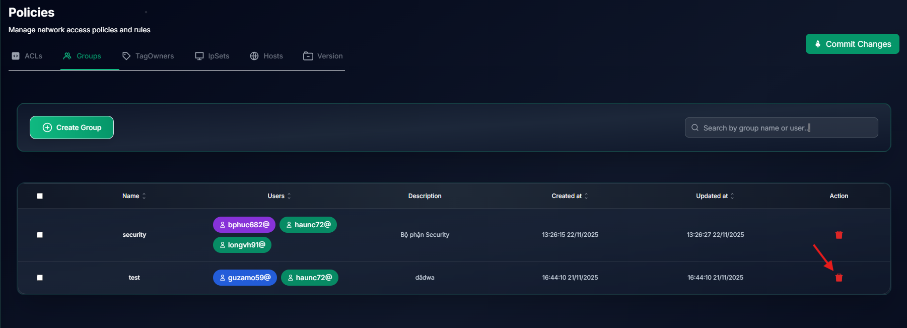

## ACL Management

### Create ACL

Tab ACL -> Create ACL

Enter ACL name and description

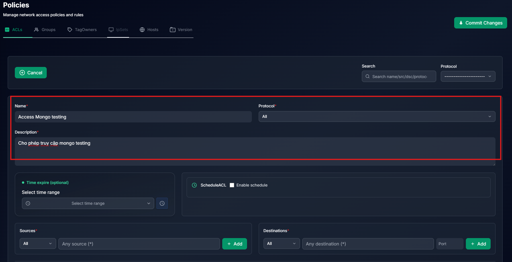

You can set time range or schedule for ACL
This feature is useful for setting policies for specific time ranges or schedules (Just In Time)

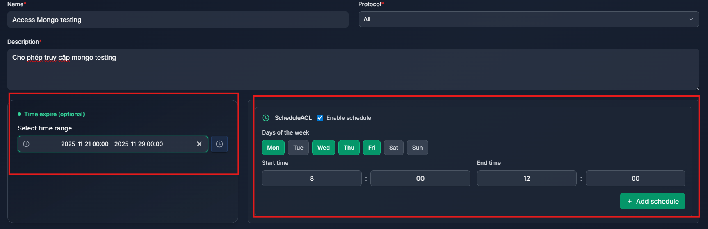

Select source and destination for ACL and click `Add`

The type source and destination can be :

- All: Allow all source or destination
- IP/CIDR: Allow specific IP or CIDR
- Group: Allow specific group
- User: Allow specific user
- Host: Allow specific host

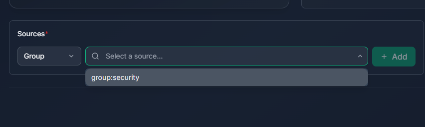

Select destination and config port for ACL
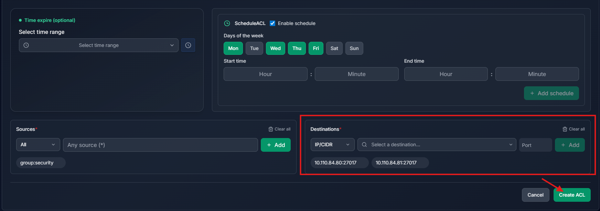

Click `Create ACL` for create ACL

Now ACL is created, we can click to enable the ACL, then commit to apply the ACL
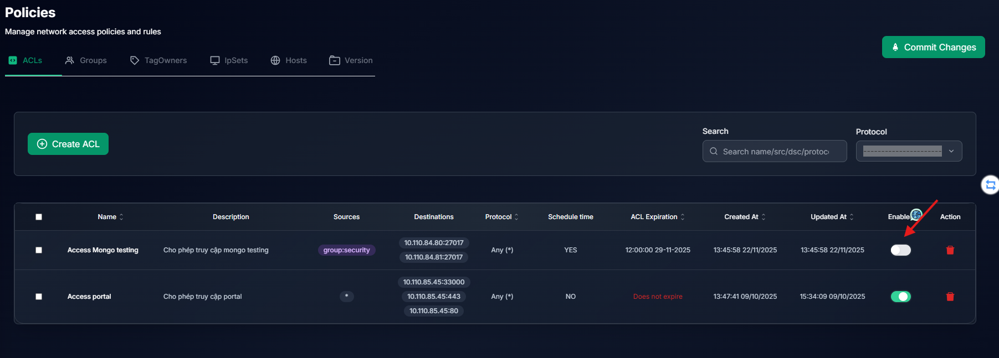

Click `Commit Changes` to apply the ACL
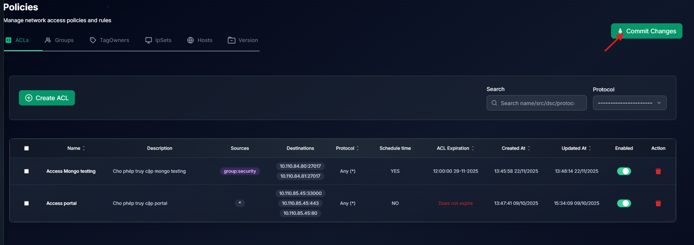

Enter description for commit change and click `Confirm & Submit` to apply the ACL

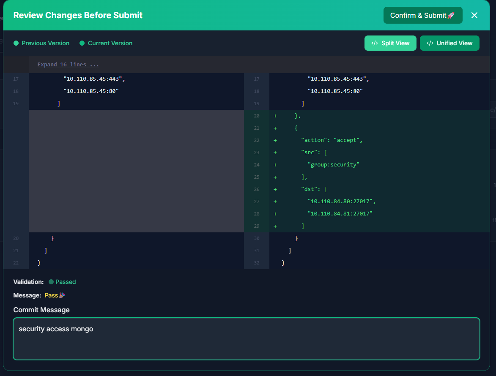
