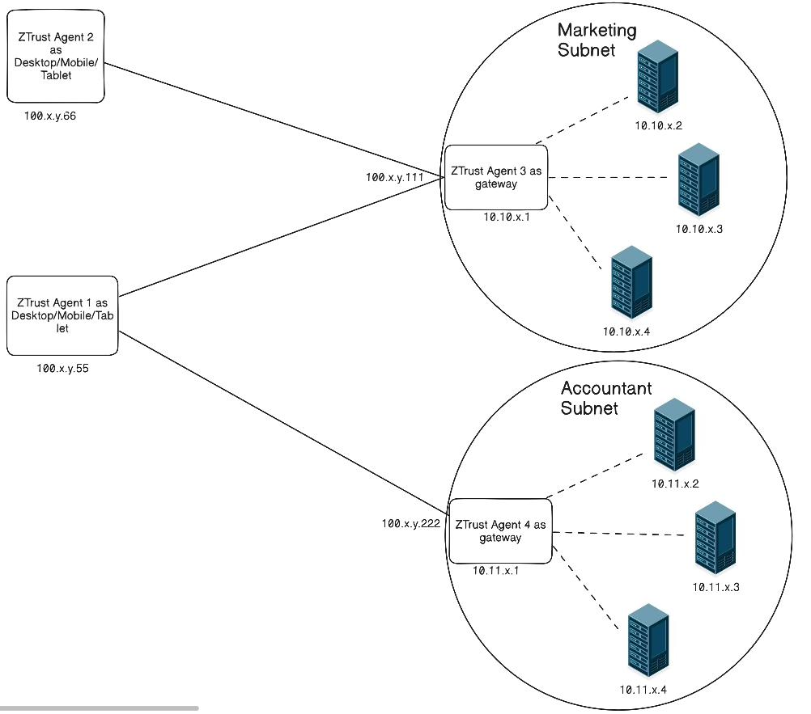
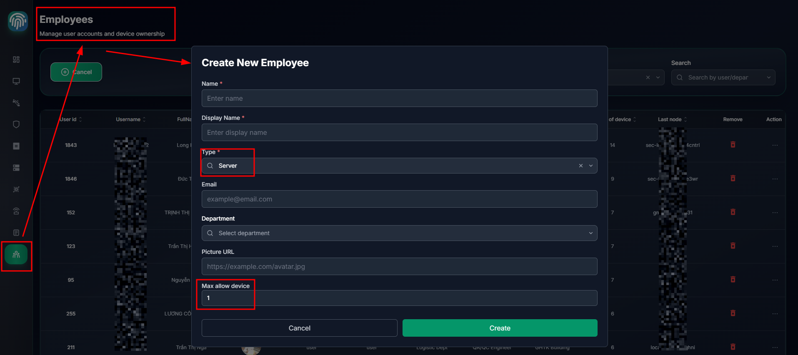
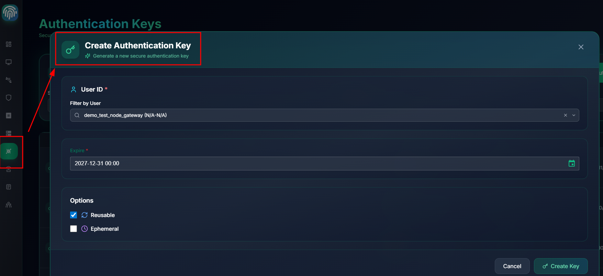
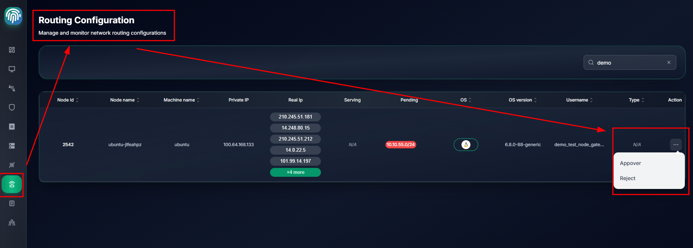
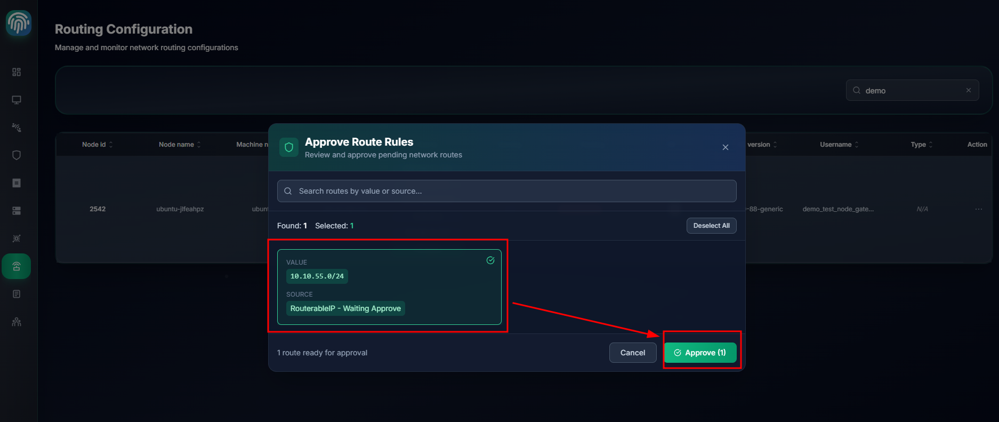
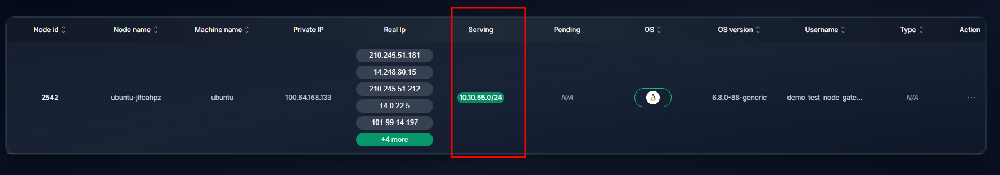
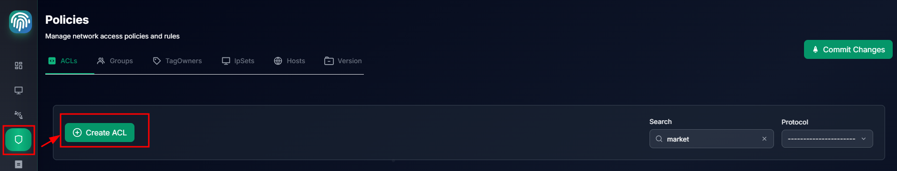
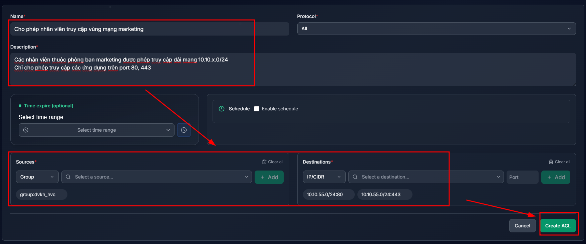
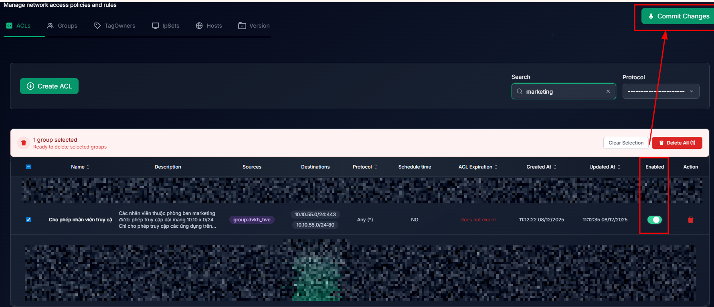

# Node Gateway & Subnet Routers



## Requirements
- Control access permissions of each employee device to internal network segments.
- A single device may be allowed to access one or multiple subnets.
- Each subnet requires only one device running the Ztrust Agent to act as a gateway; installation on all servers is not required.
- Deploy a gateway to register subnets into the Ztrust Network.

**Deployment Example**

| Device             | Role             | Ztrust Network IP | Internal Subnet                   |
| ------------------ | ---------------- | ------------------|-----------------------------------|
| **Ztrust Agent 1** | Employee Client  | 100.x.y.55        | N/A                               |
| **Ztrust Agent 2** | Employee Client  | 100.x.y.66        | N/A                               |
| **Ztrust Agent 3** | Subnet Router    | 100.x.y.111       | 10.10.x.0/24 (Marketing Subnet)   |
| **Ztrust Agent 4** | Subnet Router    | 100.x.y.222       | 10.11.x.0/24 (Accounting Subnet)  |

- Install the Ztrust Agent on four devices, including:
  - Ztrust Agent 1 and Ztrust Agent 2 are employee endpoint devices.
  - Ztrust Agent 3 is a device (workstation or server) located in the Marketing Subnet.
  - Ztrust Agent 4 is a device (workstation or server) located in the Accounting Subnet.

- Ztrust Agent 1 is granted access to resources in both the Accounting Subnet and the Marketing Subnet.
- Ztrust Agent 2 is granted access only to resources in the Marketing Subnet.

For the Ztrust Agent version designed for gateway servers, please contact the product team to download and install it.


## Configuration Steps

### 1. The administrator creates a dedicated account for each gateway node
- When creating a gateway node account, ensure that `Type = Server` is selected and the maximum number of devices is limited to 1 or 2 (in case a load balancer is used) to support non-repudiation.
- Account names should follow a consistent naming convention to simplify management and troubleshooting.  
  Example: `{subnetname}_{hostname}_gateway_01` → `marketing_haproxy_gateway_01`, `accountant_haproxy_gateway_01`


### 2. The administrator creates an Auth Key for each gateway node account
- When creating an Auth Key for a gateway node account, the following parameters must be defined:
  - **Expire**: The expiration time of the key.
  - **Reusable**: Allows the key to be reused for another login session of the node (for example, when re-authentication is required or when logging in a load balancer).
  - **Ephemeral** (not recommended for gateway nodes): Specifies whether the key is issued for a temporary node. In this case, the key will automatically expire or be revoked when the node disconnects.


### 3. On each Gateway Node, log in using the newly created accounts and register the subnet router with the Ztrust Network
**Ensure that IP forwarding is enabled on all gateway nodes (mandatory).**
```bash
echo 'net.ipv4.ip_forward = 1' | sudo tee -a /etc/sysctl.d/99-tailscale.conf
echo 'net.ipv6.conf.all.forwarding = 1' | sudo tee -a /etc/sysctl.d/99-tailscale.conf
sudo sysctl -p /etc/sysctl.d/99-tailscale.conf

```
**On Ztrust Agent 3 (Marketing Subnet)**
```bash
sudo ztrustcli login --server=https://ztcontroller.{org_domain} --auth-key={marketing_haproxy_gateway_01 auth key} --advertise-routes="10.10.x.0/24"
```
**On Ztrust Agent 4 (Accountant Subnet)**
```bash
sudo ztrustcli login --server=https://ztcontroller.{org_domain} --auth-key={accountant_haproxy_gateway_01 auth key} --advertise-routes="10.11.x.0/24"
```

### 4. On the Ztrust Controller, approve and authorize the subnet routers to operate within the network




**Wait a few minutes for the configuration to propagate across the entire network; the subnet router status will then change to `Serving`.**


### 5. On the Ztrust Controller, configure access control policies

Add a policy that allows only marketing employees to access marketing-related services within the 10.10.x.0/24 subnet on ports 80 and 443. The policy configuration is as follows:

- Manage and create policies from the `Network Policy` screen.


- Provide detailed policy information.


- Select `Enabled` (by default, newly created policies are not enabled automatically), then select `Commit changes` to confirm and apply the policy updates.



