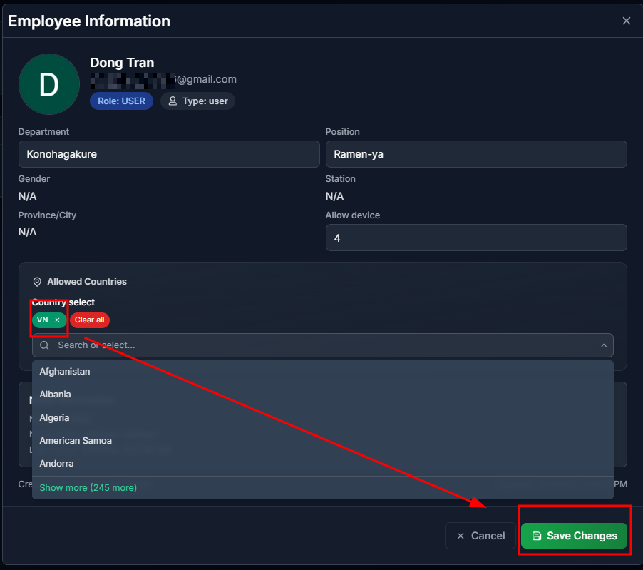
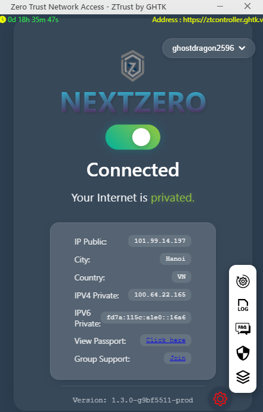
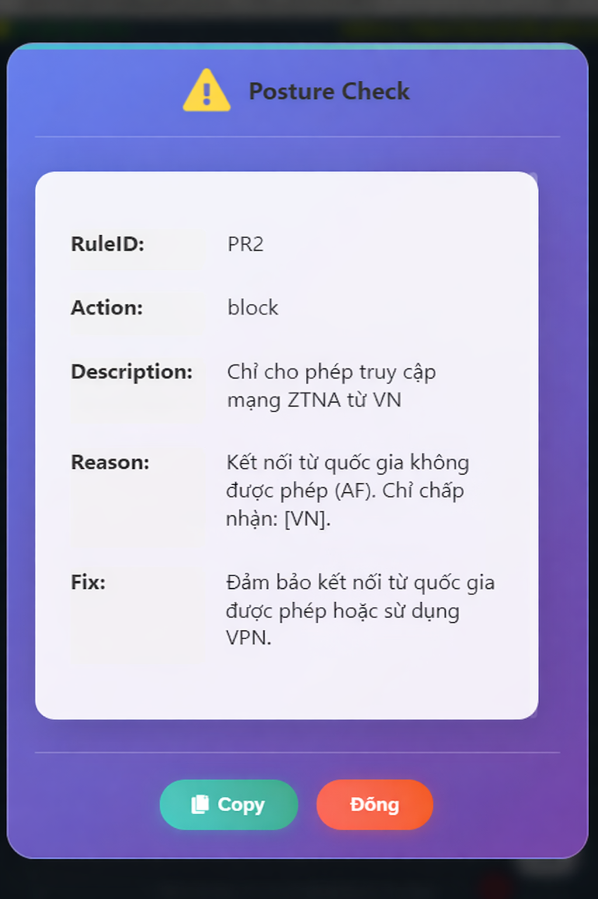

# Geo-IP Based Access Control
To validate that the Zero Trust Access system enforces geographical access control, allowing network access only from IP addresses geolocated in Vietnam (VN) and denying all connections originating outside Vietnam, regardless of authentication status.
## Allow Vietnam (VN) IP Addresses Only
Go to the `Employees` tab →  Select the employee you want to modify.
1. Configure geographic access restrictions for ZTrust by defining the allowed regions from which users may connect. Specifically, permit access for the user `Dong Tran` only when the source location is within Vietnam.

**Result**
1. Users located in Vietnam are allowed to successfully access the ZTrust network.

2. Users located outside Vietnam are denied access to the ZTrust network.
