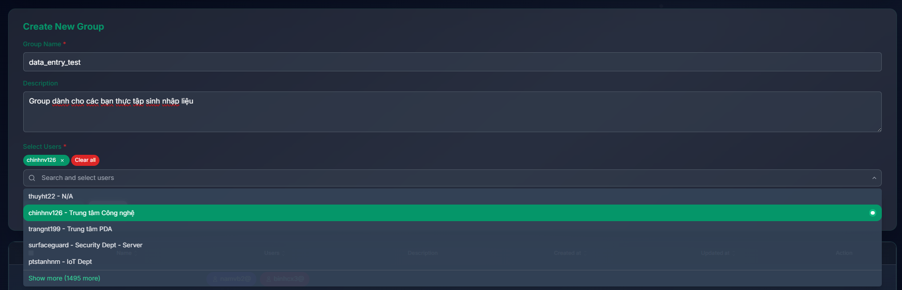
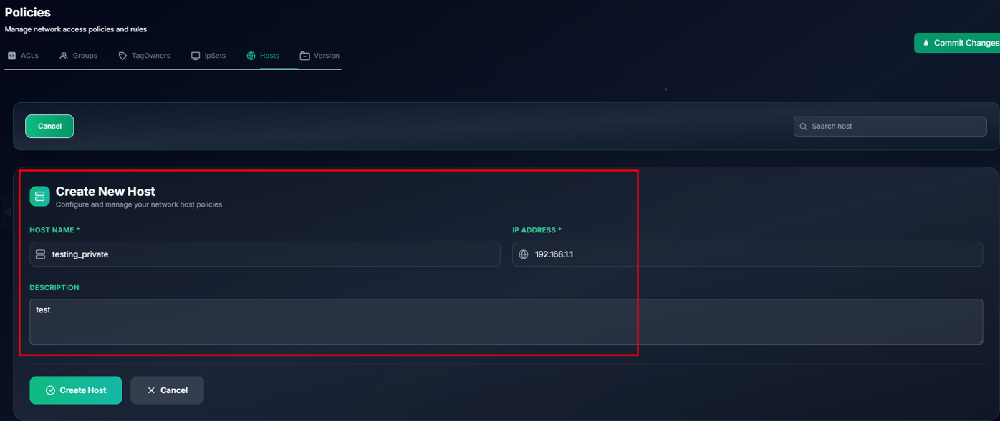
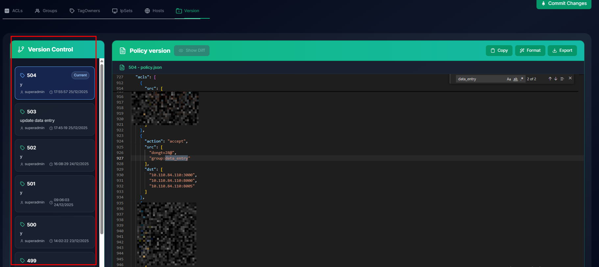

# Quản lý quyền truy cập của thiết bị khi vào mạng ztrust

## 1. Tạo chính sách

Tab `Network Policy` -> ACLs -> Create ACL

1. Cho phép các thiết bị của nhân sự thuộc nhóm data_entry và thiết bị của nhân sự dongtv28 truy cập hệ thống nhập liệu 10.110.84.110 port 3000, 8000, 8005
   ```commandline
   Name: Allow Data Entry
   Description: Cho phép nhóm nhân viên nhập liệu truy cập hệ thống 10.110.84.110 port 3000, 8000, 8005
   Protocol: ALL (TCP, UDP)
   ACL Effective Time Range: None (Do không có yêu cầu về lịch truy cập)
   Source: User:dongtv28, Group:data_entry
   Destinations: 10.110.84.110:3000, 10.110.84.110:8000, 10.110.84.110:8005
   ```
   **Sources/Destinations hỗ trợ các kiểu:** `IP/CIDR`, `Group`, `Host`, `User `

   


2. Click `Save Changes` để lưu lại chính sách
3. Click `Comit Changes`, giao diện hiển thị các dòng chính sách thay đổi, quản trị viên cần điền lý do comit và thực hiện click `Confirm & Submit`


**Chú ý mặc định các chính sách mới tạo sẽ không tự động enabled**

Cần click `Enabled` để đảm bảo chính sách được áp dụng (quá trình đợi diễn ra trong khoảng 1 phút)


## 2. Tạo nhóm người dùng

Tab `Network Policy` -> Groups -> Create Groups

1. Nhập các thông tin gồm `Group name`, `Description`, `Select Users`
   
2. Click `Create Group` để lưu lại thông tin
3. Click `Comit Changes` tương tự như bước tạo ACL.

## 3. Viết lại tên cho địa chỉ IP

Tab `Network Policy` -> Hosts-> Create Host



## 4. Quản lý lịch sử thay đổi chính sách

1. Màn hình hiển thị lịch sử các lần `comit ACL`, cung cấp tính năng so sánh sự thay đổi giữa các chính sách, tìm kiếm chính sách dưới dạng code
   