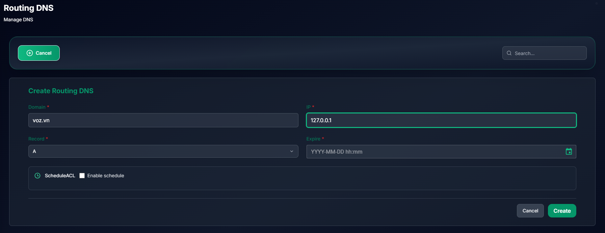
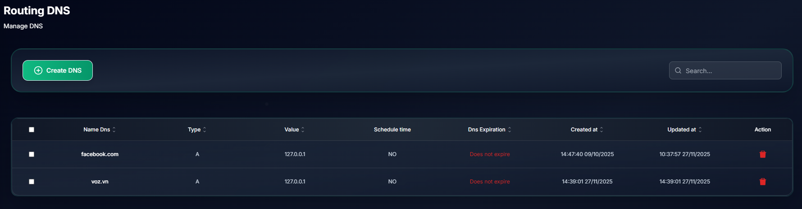
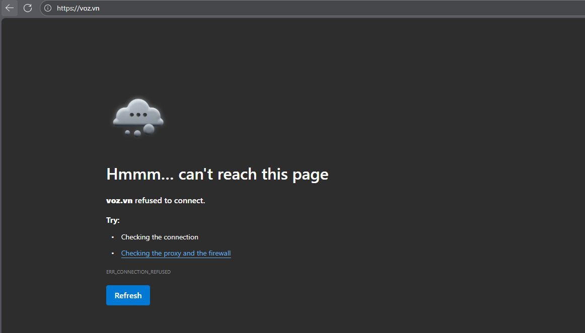

# Block Domain with NextZero

## Create DNS

Tab `Routing DNS`-> Create DNS

Create DNS with IP address 127.0.0.1 for block domain `voz.vn`

Enter DNS name and description

- Enter domain name (eg. voz.vn) and IP address (eg. 127.0.0.1) for DNS
- You can configure `expire` time and `Schedule` for DNS
- Click `Create` to create DNS

Desktop devices in your network will use this DNS to resolve domain name to IP address, so it will block domain `voz.vn`

