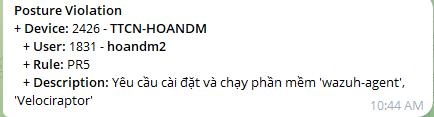

# Device Loses Compliance → Access Revoked
The Ztrust Agent integrates with endpoint security software to perform device security posture checks. Currently, Ztrust provides 9 free predefined `posture rule` templates.

Example: Devices belonging to the SEC group are required to have both `Velociraptor` and `wazuh-agent` installed when joining the Ztrust network. If the required software is not installed, the device will be `Blocked` from the Ztrust network. The detailed configuration is shown below:

User `hoandm2`, a member of the SEC group, is connected to the Ztrust network but shows signs of disabling the `Velociraptor` and `wazuh-agent` software. The device is immediately disconnected from the Ztrust network.

On the `hoandm2` endpoint, the following message is displayed:

An alert is also displayed in the administrator’s alert channel:

