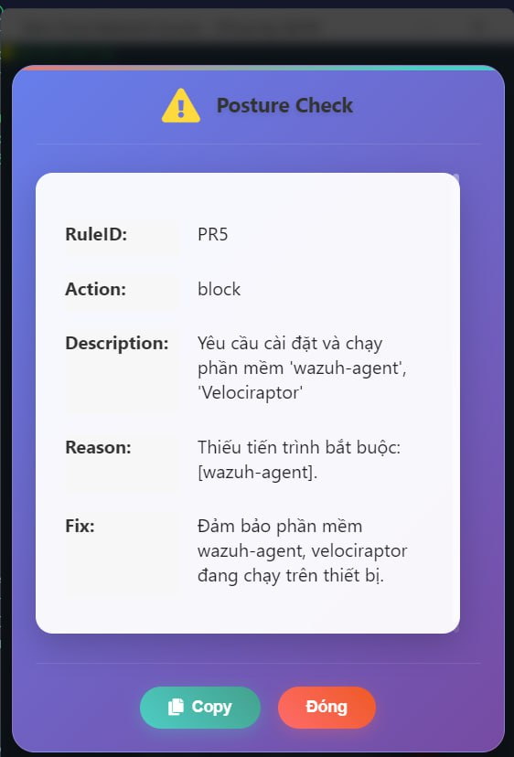

# Thiết bị mất compliance → quyền bị thu hồi
Agent Ztrust kết hợp với các phần mềm tại endpoint để thực hiện kiểm tra điều kiện bảo mật của thiết bị. Hiện tại Ztrust đang cung cấp 9 mẫu `posture rule` miễn phí.

Ví dụ: Yêu các thiết bị thuộc nhóm SEC khi tham gia vào mạng Ztrust bắt buộc phải cài đặt phần mềm `Velociraptor` và `wazuh-agent`, nếu không cài đặt sẽ thực hiện `Block` khỏi mạng Ztrust. Chi tiết cấu hình như sau:

Người dùng `hoandm2` thuộc nhóm SEC đang truy cập mạng Ztrust nhưng có dấu hiệu tắt phần mềm `Velociraptor` và `wazuh-agent`. Ngay lập tức bị đẩy ra khỏi mạng Ztrust.

Trên máy `hoandm2` sẽ hiển thị thông tin sau:

Trên kênh cảnh báo của quản trị viên cũng hiển thị cảnh bảo:

