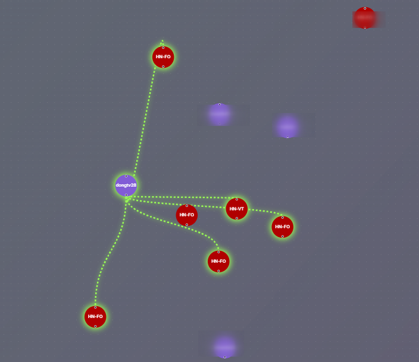
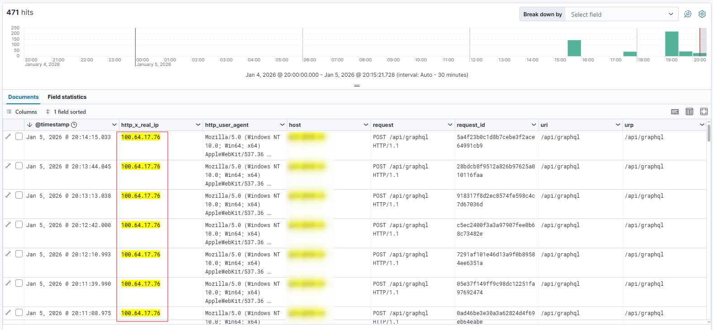
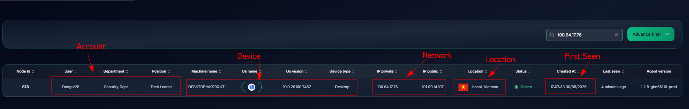

# Tracing and Isolating High-Risk Entities

Each device that connects to the Ztrust network is assigned a unique IP address that remains fixed until the device is completely removed from the network. This means that even if a device connects to or disconnects from the Ztrust network multiple times, its Ztrust IP address remains unchanged.

The system aggregates connected devices' IP addresses and their connection logs to construct a comprehensive corporate Netmap (access map).

In the event of an incident, the system leverages assigned static IP addresses and user accounts to swiftly identify suspicious actors.

Mapping IP addresses to users and devices:

If a device attempts to alter its assigned IP address, it will be immediately disconnected from the Ztrust network and will no longer be able to access any resources.
