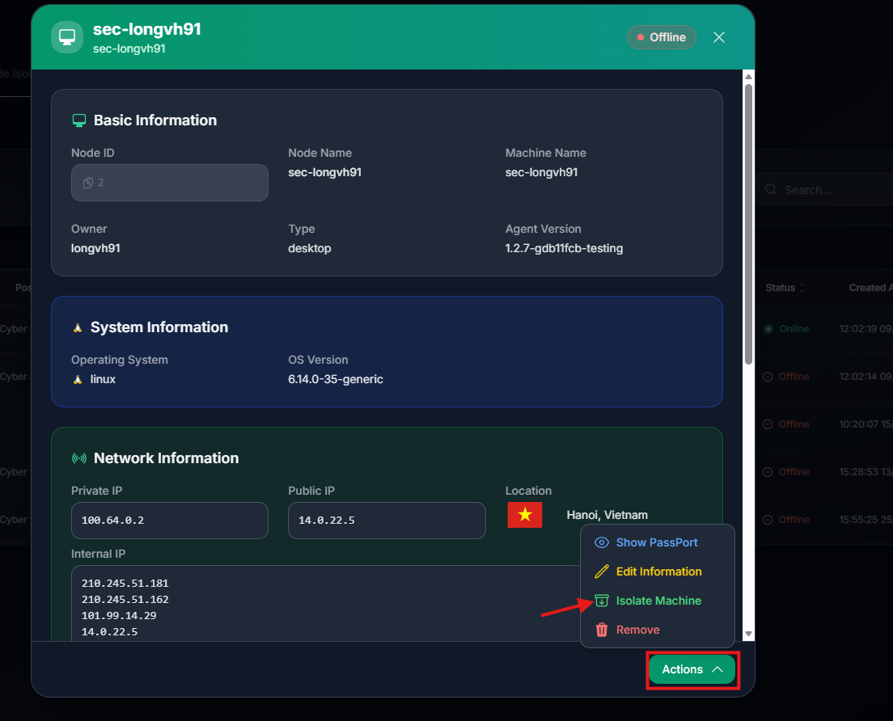
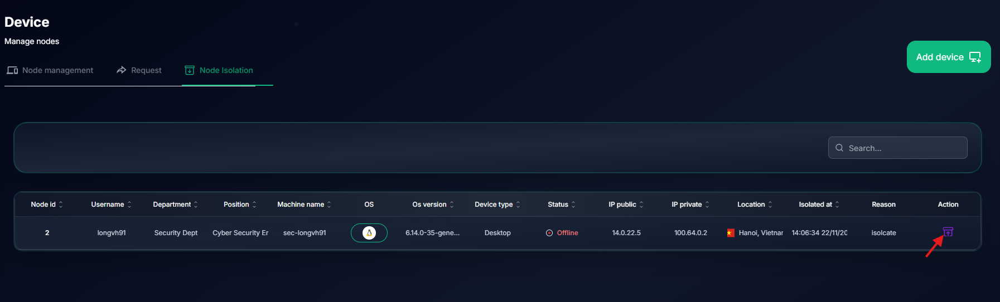

# Isolate Device

You can isolate a device to prevent it from accessing the network immediately, that device will be isolated until you unisolate it

`Click a device` > `Actions` > `Isolate Machine`

You can unisolate a device to allow it to access the network in Tab `Node Isolation`

