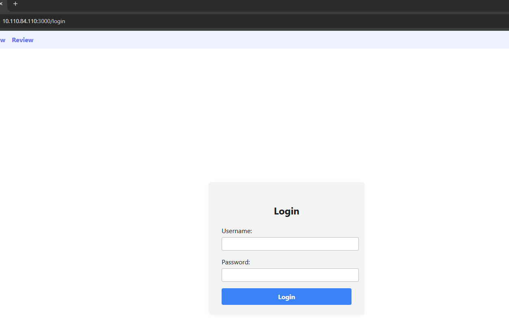
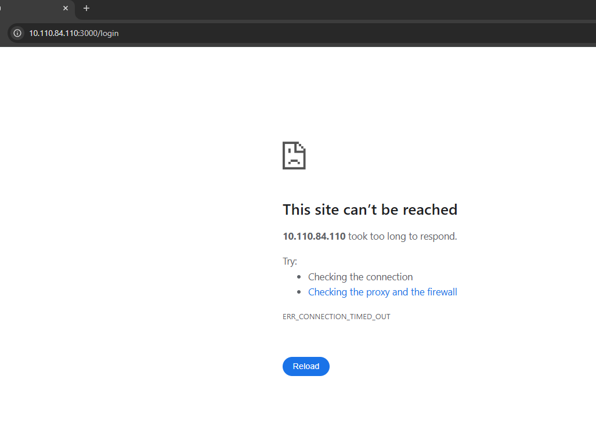

#  Time-Bound Access to Resources


## 1. Policy Creation

Go to the `Network Policy` tab → ACLs → Create ACL.

1. Allow devices of users in the `data_entry` group and devices of user `dongtv28` to access the data entry system at 10.110.84.110 on ports 3000, 8000, and 8005 during business hours from 09:00 to 18:00. 

   **Sources/Destinations hỗ trợ các kiểu:** `IP/CIDR`, `Group`, `Host`, `User `
   ```
   Name: Allow Data Entry
   Description: Allow the data entry staff group to access the system at 10.110.84.110 on ports 3000, 8000, and 8005 from 09:00 to 18:00, Monday to Friday
   Protocol: ALL (TCP, UDP)
   ACL Effective Time Range: 9h - 18h Mon -> Fri
   Source: User:dongtv28, Group:data_entry
   Destinations: 10.110.84.110:3000, 10.110.84.110:8000, 10.110.84.110:8005
   ```
    


3. Click `Save Changes` to save the policy.
4. Click `Commit Changes`. The interface will display the modified policy entries. The administrator must provide a commit reason and then click `Confirm & Submit`.


**Note: By default, newly created policies are not automatically enabled.**

   You must click `Enabled` to ensure the policy is enforced (the propagation process takes approximately 1 minute).


**Result**
- User `dongtv28` and members of the `data_entry` group can access the system during the permitted time window.

- User `dongtv28` and members of the `data_entry` group cannot access the system outside the authorized time window.


