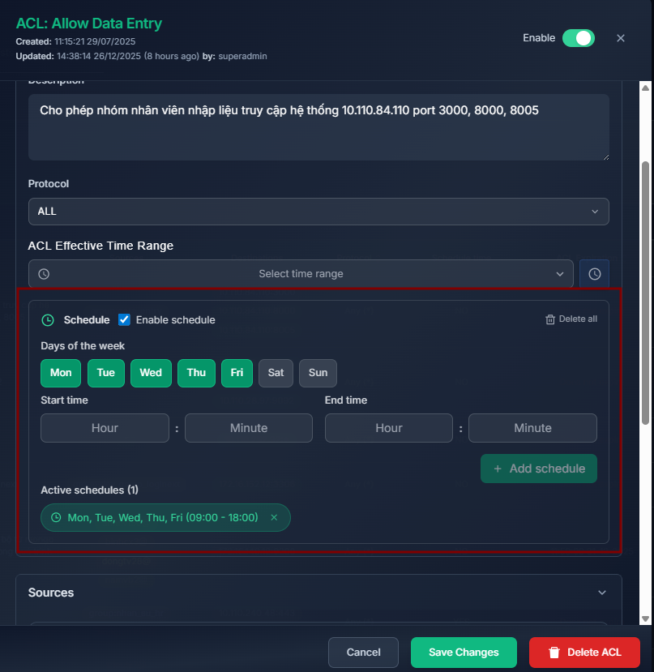
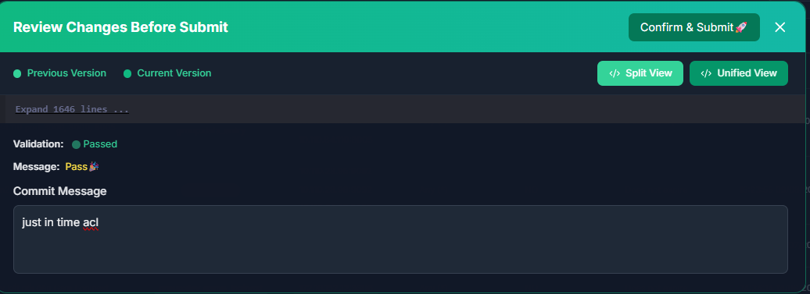
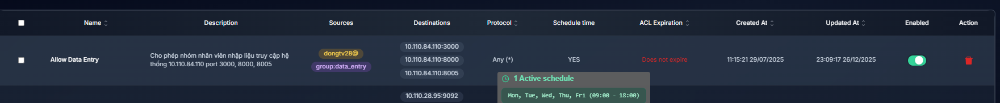

# Cấp quyền truy cập tài nguyên trong thời gian giới hạn


## 1. Tạo chính sách

Tab `Network Policy` -> ACLs -> Create ACL

1. Cho phép các thiết bị của nhân sự thuộc nhóm data_entry và thiết bị của nhân sự dongtv28 truy cập hệ thống nhập liệu 10.110.84.110 port 3000, 8000, 8005 trong khoảng thời gian hành chính từ 9h - 18h 

   **Sources/Destinations hỗ trợ các kiểu:** `IP/CIDR`, `Group`, `Host`, `User `
   ```commandline
   Name: Allow Data Entry
   Description: Cho phép nhóm nhân viên nhập liệu truy cập hệ thống 10.110.84.110 port 3000, 8000, 8005 từ 9h - 18h thứ 2 đến thứ 6
   Protocol: ALL (TCP, UDP)
   ACL Effective Time Range: 
   Source: User:dongtv28, Group:data_entry
   Destinations: 10.110.84.110:3000, 10.110.84.110:8000, 10.110.84.110:8005
   ```
    


3. Click `Save Changes` để lưu lại chính sách
4. Click `Comit Changes`, giao diện hiển thị các dòng chính sách thay đổi, quản trị viên cần điền lý do comit và thực hiện click `Confirm & Submit`


**Chú ý mặc định các chính sách mới tạo sẽ không tự động enabled**

Cần click `Enabled` để đảm bảo chính sách được áp dụng (quá trình đợi diễn ra trong khoảng 1 phút)


**Kết quả**
- Nhân sự dongtv28 và các nhân sự thuộc nhóm data_entry truy cập trong khoảng thời gian được cho phép

- Nhân sự dongtv28 và các nhân sự thuộc nhóm data_entry không thể truy cập trong khoảng thời gian trái phép


