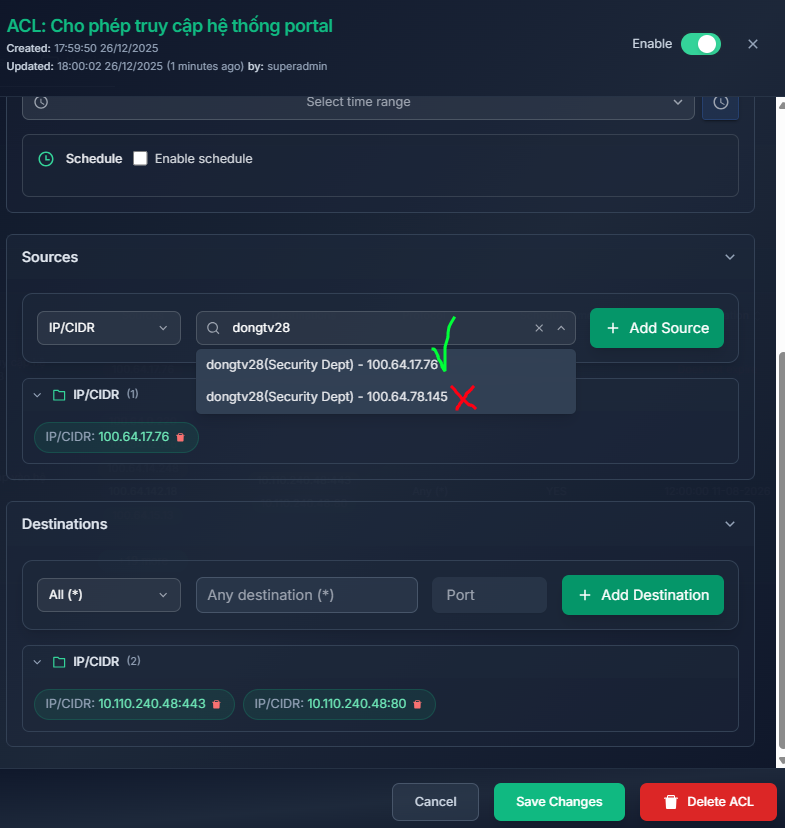
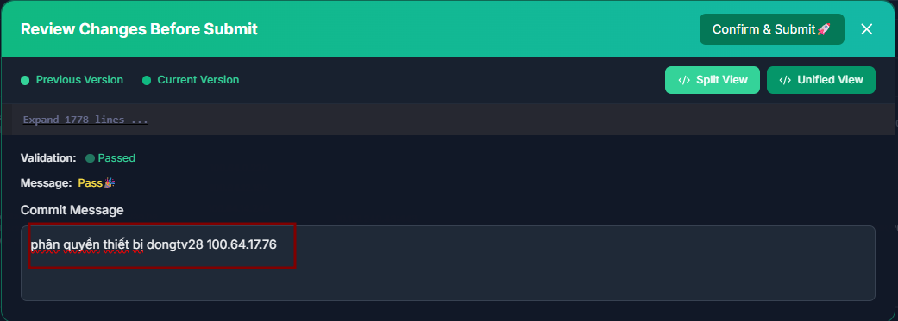
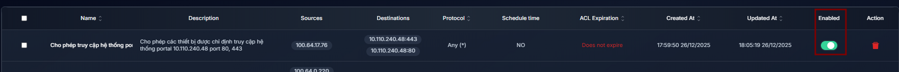
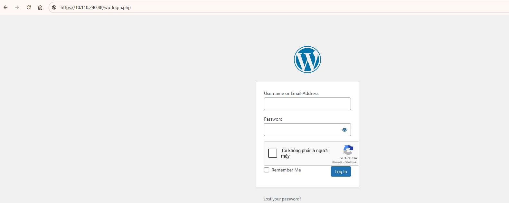

# Node Access Restricted to Explicitly Authorized Services

## 1. Policy Creation

Go to the `Network Policy` tab → ACLs → Create ACL.

1. Allow only the specified devices to access the portal system at 10.110.240.48 on ports 80 and 443.
   
    **Sources/Destinations hỗ trợ các kiểu:** `IP/CIDR`, `Group`, `Host`, `User `
    ```
   Name: Allow Data Entry
   Description: Allow the specified devices to access the portal system at 10.110.240.48 on ports 80 and 443
   Protocol: ALL (TCP, UDP)
   ACL Effective Time Range: None (no access schedule is required)
   Source: 100.64.17.76
   Destinations: 10.110.240.48:80, 10.110.240.48:443
   ```
         
    User `dongtv28` has two devices with Ztrust Network IP addresses `100.64.17.76` and `100.64.78.145`. Only the device with IP `100.64.17.76` is allowed to access; the other device is denied.
   

3. Click `Save Changes` to save the policy.
4. Click `Commit Changes`. The interface will display the modified policy entries. The administrator must provide a commit reason and then click `Confirm & Submit`.


   Click `Enabled` to ensure the policy is enforced (the propagation process takes approximately 1 minute).


**Result**
- Device `100.64.17.76` of user `dongtv28` can access the service.

- Device `100.64.78.145` of user `dongtv28` cannot access the service.

