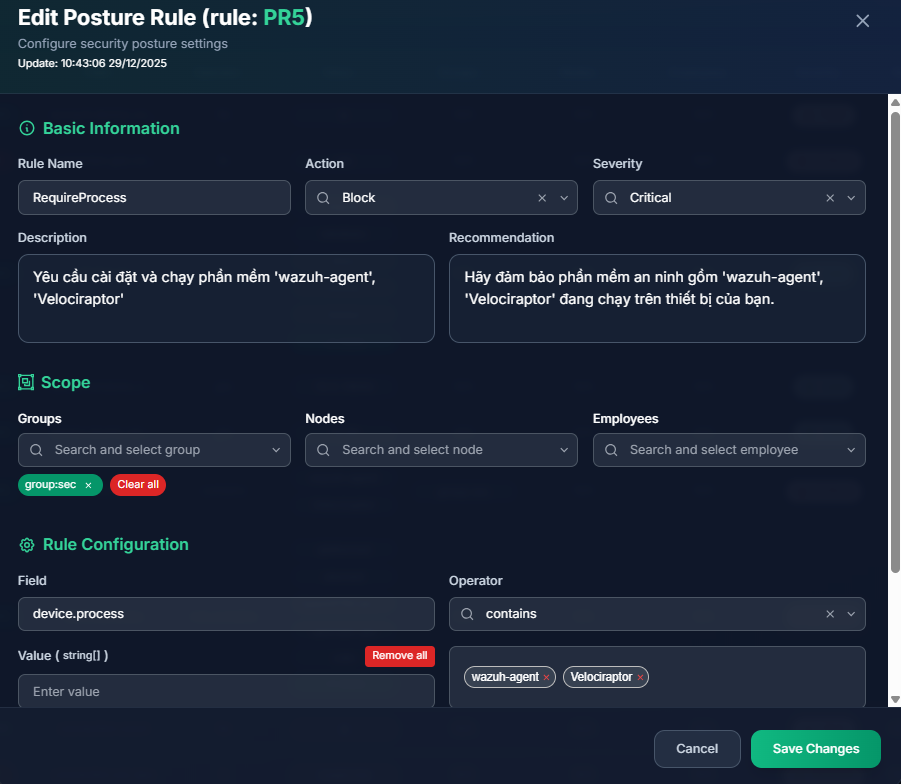
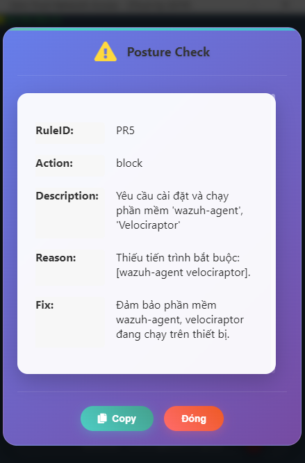
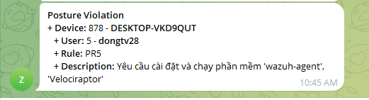

# Non-Compliant Devices → Denied from Joining Ztrust

The Ztrust Agent integrates with endpoint security software to perform device security posture checks. Currently, Ztrust provides 9 free predefined `posture rule` templates.

Example: Devices belonging to the SEC group are required to have both `Velociraptor` and `wazuh-agent` installed in order to join the Ztrust network. If the required software is not installed, the device will be `Blocked` from the Ztrust network. The detailed configuration is shown below:

When a user in the SEC group attempts to access the network without having all required software installed, access is denied and the following notification is displayed:

At the same time, an alert is sent to the administrator:

