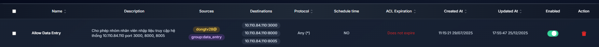
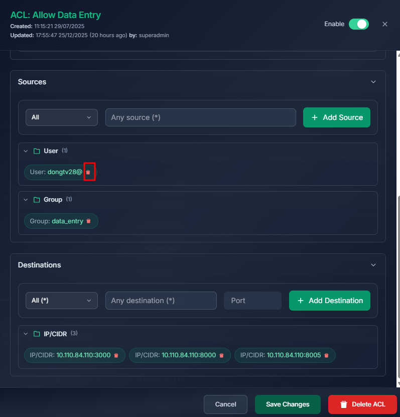
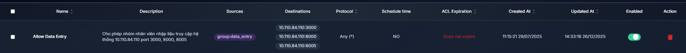
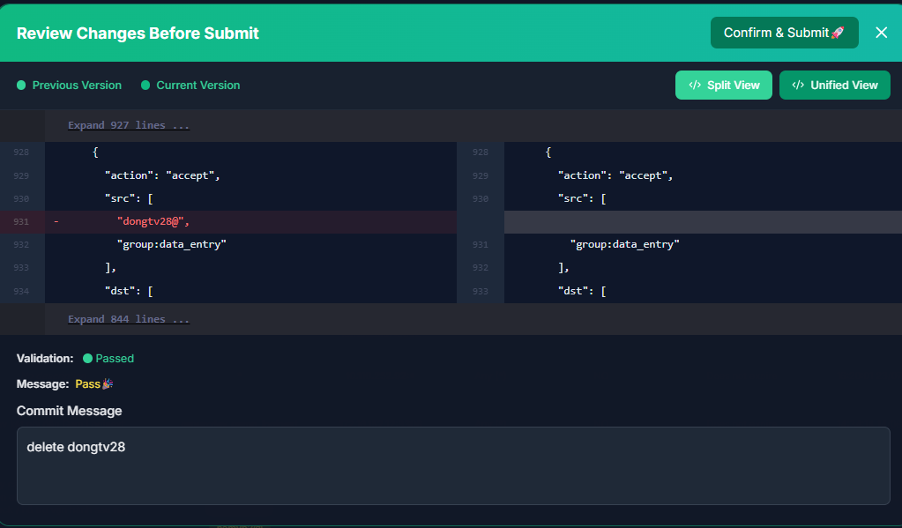
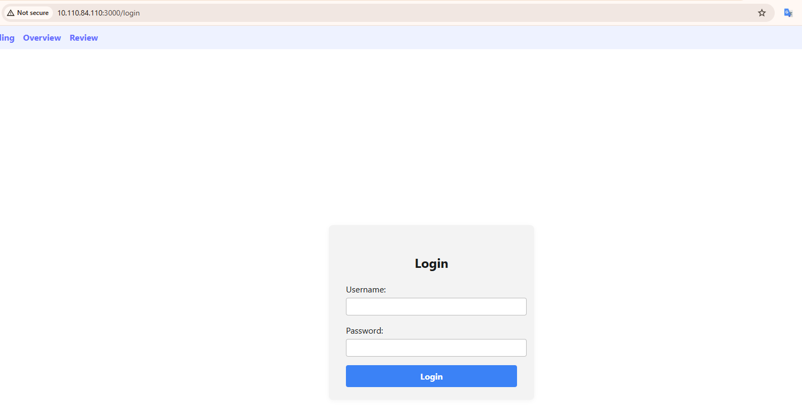
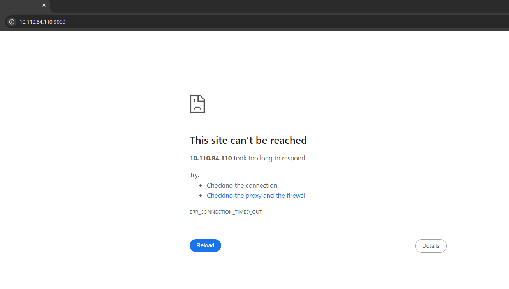

# Instant ACL Changes Enforcement

## 1. Policy Update

Go to the `Network Policy` tab → ACLs → Select the ACL you want to modify.

1. The ACL configuration to be edited is as follows:

2.  Modify the permissions so that user dongtv28 is no longer allowed to access 10.110.84.110 on ports 3000, 8000 and 8005.
   
    ```commandline
       Name: Allow Data Entry
       Description: Allow the data entry staff group to access the system at 10.110.84.110 on ports 3000, 8000 and 8005
       Protocol: ALL (TCP, UDP)
       ACL Effective Time Range: None (no access schedule is required)
       Source: Group:data_entry (loại bỏ User:dongtv28)
       Destinations: 10.110.84.110:3000, 10.110.84.110:8000, 10.110.84.110:8005
    ```
    **Supported Source/Destination types:** `IP/CIDR`, `Group`, `Host`, `User `
    

3. Click Save Changes to persist the policy. The policy state after removing user dongtv28:
    

    Click `Commit Changes`. The interface will display the modified policy entries. The administrator must provide a commit reason and then click `Confirm & Submit`.
    
**Result**
- User dongtv28 **before** the administrator revoked access:

- User dongtv28 **after** the administrator revoked access. Access to the service is immediately blocked:

