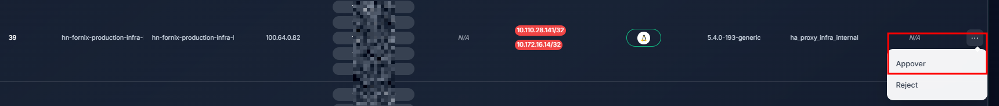
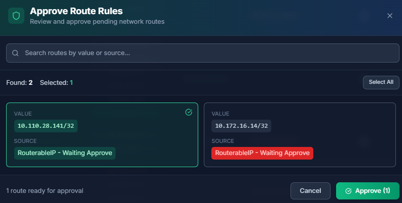
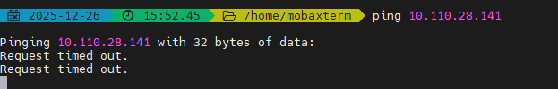
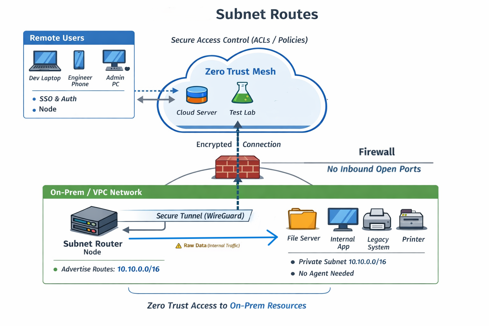

# Subnet Router – Truy cập mạng on-prem theo Zero Trust

Cách thức mạng Ztrust đảm bảo tính linh hoạt, dễ mở rộng trong khi đảm bảo tính an toàn bảo mật khi triển khai cùng với mạng legacy / on-prem / cloud VPC. Tham khảo mô hình ví dụ tại [routes](../Operations/routes.md)  

Tab `Router Gateway` -> Chọn Action với từng node gateway cần phê duyệt

1. Chọn node gateway đang chờ approve subnet route, sau đó nhấn nút `Appover`

2. Chọn subnet route muốn phê duyệt, sau đó nhấn nút `Approve`

3. Đợi ít phút để cập nhật thông tin cho toàn mạng. Tại thời điểm hiện tại, các lưu lượng khi đến subnet 10.110.24.141/32 sẽ được node-gateway phụ trách chuyển tiếp.
4. Kết quả người dùng có thể truy cập được các vùng mạng private trên on-prem của tổ chức.
5. 
Trước khi có triển khai subnet route

Sau khi có triển khai subnet route

**Chú ý:**
- Subnet route chỉ hoạt động khi đạt đồng thời 2 điều kiện sau: Có node gateway khai báo subnet route và có sự cho phép của ztrust controller.
- Chỉ cần node-gateway tham gia vào mạng ztrust, các subnet đằng sau node-gateway không cần kết nối ztrust.
- Trong trường hợp khai báo trùng subnet route, ztrust sẽ ưu tiên dùng node gateway khai báo đầu tiên.
- Ztrust ưu tiên sử dụng node gateway có khai báo subnet nhỏ hơn. Ví dụ: Node gateway A khai báo route cho subnet 10.10.10.0/16, node gateway B khai báo route cho subnet 10.10.10.0/24 => Ưu tiên B.
