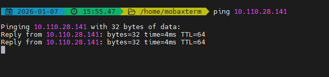

# Subnet Router – Zero Trust Access to On-Prem Networks

Ztrust networking ensures flexibility and scalability while maintaining strong security when integrated with legacy, on-premises, or cloud VPC environments. Refer to the sample architecture at [routes](../Operations/routes.md).  

Go to the `Router Gateway` tab → Select an Action for each gateway node that requires subnet route approval.

1. Select the gateway node that is pending subnet route approval, then click the `Approver` button.

2. Select the subnet route to be approved, then click the `Approve` button.

3. Wait a few minutes for the configuration to be propagated across the entire network. At this point, traffic destined for subnet 10.110.24.141/32 will be forwarded by the responsible node-gateway.
4. As a result, users can access the organization’s private on-prem network segments.

- Before subnet routing is enabled
  
  

- After subnet routing is enabled
  
  

**Notes:**
- Subnet routing is effective only when both conditions are met: a gateway node advertises the subnet route, and the route is explicitly approved by the Ztrust controller.
- Only the node-gateway needs to join the Ztrust network; the subnets behind the node-gateway do not require direct Ztrust connectivity.
- In case of duplicate subnet route advertisements, Ztrust prioritizes the gateway node that registered the route first.
- Ztrust prefers gateway nodes advertising more specific (smaller) subnets. For example: Gateway A advertises subnet 10.110.24.141/16, while Gateway B advertises subnet 10.110.24.141/24 → Gateway B is preferred.
